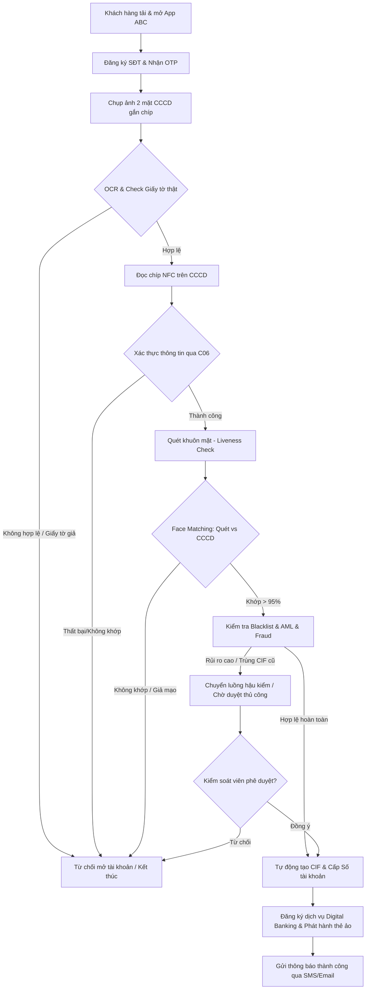

# TÀI LIỆU PHÂN TÍCH YÊU CẦU NGHIỆP VỤ (BRD)
## HỆ THỐNG MỞ TÀI KHOẢN VÀ PHÁT HÀNH THẺ TRỰC TUYẾN QUA eKYC (ABC BANK)

---

### THÔNG TIN TÀI LIỆU (DOCUMENT CONTROL)
*   **Tên dự án:** Số hóa quy trình mở tài khoản và phát hành thẻ trực tuyến (eKYC Digitization Project)
*   **Mã dự án:** ABC-eKYC-2026
*   **Phiên bản:** v1.1
*   **Tác giả:** Ban Dự án Ngân hàng số ABC (Senior Business Analyst)
*   **Trạng thái:** Dự thảo phê duyệt
*   **Mục tiêu cốt lõi:** **Zero Manual Operation (STP - Straight-Through Processing)** - Tự động hóa 100% quy trình từ khi khách hàng đăng ký đến khi cấp số tài khoản và phát hành thẻ ảo, không yêu cầu sự can thiệp thủ công của giao dịch viên tại quầy hoặc kiểm soát viên hậu kiểm trong luồng chuẩn (Happy Path).

---

## 1. TỔNG QUAN DỰ ÁN & MỤC TIÊU CHIẾN LƯỢC

### 1.1. Bối cảnh
Ngân hàng số ABC Bank hướng tới tối ưu hóa trải nghiệm khách hàng và giảm chi phí vận hành (OpEx) bằng cách chuyển dịch toàn bộ quy trình mở tài khoản và phát hành thẻ vật lý/thẻ phi vật lý từ kênh truyền thống (tại quầy) sang kênh số (Mobile Banking App). Quy trình định danh điện tử (eKYC) sẽ là chìa khóa để xác thực danh tính khách hàng một cách chính xác, tuân thủ pháp luật và an toàn bảo mật.

### 1.2. Mục tiêu chiến lược (Core Goals)
*   **Tối ưu hóa vận hành (Straight-Through Processing - STP):** Đạt tỷ lệ tự động phê duyệt (Auto-approval rate) tối thiểu 90% đối với các hồ sơ hợp lệ.
*   **Rút ngắn thời gian (Time-to-Market):** Thời gian hoàn thành quy trình mở tài khoản và cấp thẻ ảo cho khách hàng dưới 2 phút.
*   **An toàn và Tuân thủ:** Đảm bảo tuân thủ nghiêm ngặt các thông tư, quyết định của Ngân hàng Nhà nước Việt Nam (Thông tư 16/2020/TT-NHNN, Quyết định 2345/QĐ-NHNN về an toàn sinh trắc học và Nghị định 13/2023/NĐ-CP về bảo vệ dữ liệu cá nhân).

---

## 2. CÁC TÁC NHÂN THAM GIA HỆ THỐNG (ACTORS)

| STT | Actor | Loại | Mô tả vai trò trong hệ thống |
| :--- | :--- | :--- | :--- |
| 1 | **Khách hàng cá nhân (Customer)** | External | Chủ thể thực hiện quy trình mở tài khoản trên ứng dụng di động (ABC Mobile App). Họ tương tác trực tiếp với giao diện để cung cấp thông tin, chụp giấy tờ và quét khuôn mặt. |
| 2 | **Hệ thống eKYC Engine** | Internal/Partner | Hệ thống lõi xử lý định danh, bao gồm: - **OCR Engine:** Trích xuất thông tin từ CCCD. - **Liveness Check Engine:** Xác thực khuôn mặt người thật (chống giả mạo bằng ảnh, video, mặt nạ). - **Face Matching Engine:** So sánh khuôn mặt thực tế với ảnh trên CCCD. |
| 3 | **Cơ sở dữ liệu Quốc gia về Dân cư (C06 - Bộ Công an)** | External | Hệ thống xác thực thông tin căn cước công dân gắn chíp và sinh trắc học (qua kết nối API trực tiếp hoặc qua thiết bị đọc thẻ/NFC kết nối với điện thoại khách hàng). |
| 4 | **Hệ thống Core Banking & Card Core** | Internal | Hệ thống quản lý tài khoản và thẻ của ngân hàng, chịu trách nhiệm sinh số tài khoản (CIF), tạo tài khoản thanh toán, và phát hành thẻ ảo (Virtual Card) tự động. |
| 5 | **Hệ thống Phòng chống Gian lận (Fraud Detection / AML)** | Internal | Hệ thống quét danh sách đen (Blacklist), danh sách cấm vận, PEP (Politically Exposed Persons), kiểm tra thiết bị gian lận (Device Fingerprinting), định vị GPS để phát hiện các hành vi bất thường. |
| 6 | **Kiểm soát viên Hậu kiểm (Compliance / Anti-Fraud Officer)** | Internal | Nhân sự của ngân hàng chỉ tham gia xử lý các trường hợp hệ thống nghi ngờ gian lận (Flagged) hoặc kiểm tra xác suất định kỳ (hậu kiểm). Không tham gia vào luồng phê duyệt mở tài khoản thông thường. |

---

## 3. LUỒNG NGHIỆP VỤ CHI TIẾT (BUSINESS FLOW)

### 3.1. Sơ đồ quy trình tổng thể (Mermaid Flowchart)

### 3.2. Mô tả chi tiết từng bước (Happy Path & Exception Handling)

#### **Bước 1: Khởi động và Xác thực số điện thoại**
*   **Luồng nghiệp vụ:**
    1. Khách hàng mở ứng dụng, chọn "Mở tài khoản trực tuyến".
    2. Khách hàng nhập Số điện thoại di động chính chủ.
    3. Hệ thống gửi mã OTP qua SMS/Voice OTP. Khách hàng nhập OTP để xác thực quyền sở hữu số điện thoại.
*   **Exception Handling:**
    *   SĐT đã được đăng ký tài khoản tại ABC Bank -> Hệ thống hiển thị thông báo hướng dẫn đăng nhập hoặc lấy lại mật khẩu (Không cho phép đăng ký mới).
    *   Nhập sai OTP quá 3 lần -> Khóa số điện thoại trong 15 phút.

#### **Bước 2: Chụp ảnh Căn cước công dân (CCCD) và xử lý OCR**
*   **Luồng nghiệp vụ:**
    1. Hệ thống yêu cầu quyền truy cập Camera và hướng dẫn khách hàng chụp mặt trước và mặt sau của CCCD gắn chíp.
    2. **OCR Engine** tự động trích xuất các trường thông tin: Số CCCD, Họ tên, Ngày sinh, Giới tính, Quê quán, Nơi thường trú, Ngày hết hạn.
    3. Hệ thống hiển thị lại các thông tin đã trích xuất để khách hàng kiểm tra.
*   **Exception Handling:**
    *   Ảnh chụp mờ, lóa sáng, mất góc hoặc nghi ngờ photocopy/giấy tờ giả -> Hệ thống yêu cầu chụp lại tối đa 3 lần. Sau 3 lần thất bại, từ chối và hướng dẫn ra quầy.

#### **Bước 3: Đọc dữ liệu thẻ chíp CCCD qua kết nối NFC (Áp dụng theo quy định mới)**
*   **Luồng nghiệp vụ:**
    1. Hướng dẫn khách hàng áp mặt sau của CCCD vào đầu đọc NFC trên điện thoại để đọc dữ liệu mã hóa trong chíp.
    2. Hệ thống gửi dữ liệu đọc được lên **Cơ sở dữ liệu Quốc gia về Dân cư (C06)** để kiểm tra tính toàn vẹn của dữ liệu và chữ ký số của Bộ Công an.
*   **Exception Handling:**
    *   Thiết bị của khách hàng không hỗ trợ NFC -> Chuyển hướng sang luồng eKYC thông thường (chụp ảnh 2 mặt và quét khuôn mặt nâng cao) nhưng giới hạn hạn mức giao dịch thấp hơn, hoặc yêu cầu xác thực qua Video Call tự động.

#### **Bước 4: Quét sinh trắc học khuôn mặt (Liveness Check & Face Matching)**
*   **Luồng nghiệp vụ:**
    1. Hệ thống yêu cầu khách hàng giữ điện thoại thẳng mặt, thực hiện các cử động ngẫu nhiên (quay trái, quay phải, mỉm cười, nháy mắt) để thực hiện **Active Liveness Check** kết hợp **Passive Liveness** (phân tích cấu trúc da, ánh sáng phản chiếu để chống dùng ảnh chụp/video/deepfake).
    2. **Face Matching Engine** thực hiện so sánh khuôn mặt thực tế vừa quét với ảnh chân dung lưu trong chíp CCCD (hoặc ảnh chụp CCCD nếu không quét được NFC).
*   **Exception Handling:**
    *   Tỷ lệ trùng khớp khuôn mặt (Matching Score) dưới 95% -> Yêu cầu quét lại. Quá 3 lần không khớp -> Chuyển hồ sơ sang trạng thái "Nghi ngờ" để Kiểm soát viên hậu kiểm (Không cấp tài khoản tự động ngay).

#### **Bước 5: Kiểm tra Gian lận (Fraud & AML Check)**
*   **Luồng nghiệp vụ:**
    1. Hệ thống tự động quét thông tin khách hàng qua danh sách cấm vận (Sanction List), danh sách PEP (Chính trị gia), danh sách đen nội bộ của ngân hàng (Internal Blacklist).
    2. Hệ thống kiểm tra Device ID, IP Address và GPS Location xem có nằm trong danh sách thiết bị gian lận hoặc vị trí rủi ro cao (ngoài lãnh thổ Việt Nam) hay không.
*   **Exception Handling:**
    *   Trùng khớp với danh sách PEP/Blacklist -> Từ chối mở tài khoản tự động, ghi nhận log báo cáo AML.

#### **Bước 6: Cấp số tài khoản tự động & Phát hành thẻ (STP - Phê duyệt tự động)**
*   **Luồng nghiệp vụ:**
    1. Khi tất cả các bước trên đều trả về kết quả Hợp lệ (Green), hệ thống tự động gọi API sang **Core Banking** để tạo mã khách hàng (CIF), mở tài khoản thanh toán mặc định.
    2. Hệ thống hiển thị danh sách số tài khoản đẹp (nếu khách hàng có nhu cầu chọn số).
    3. Thực hiện phát hành thẻ phi vật lý (Virtual Debit/Credit Card) trên ứng dụng ngay lập tức nếu khách hàng đăng ký mở thẻ.
    4. Gửi SMS/Email thông báo thông tin tài khoản và hướng dẫn kích hoạt dịch vụ ngân hàng số.

---

## 4. YÊU CẦU CHỨC NĂNG (FUNCTIONAL REQUIREMENTS)

### 4.1. Phân hệ Front-end (Mobile Banking App - iOS/Android)
*   **FR-FE-001 (Đăng ký tài khoản):** Cho phép nhập Số điện thoại, Email và gửi yêu cầu xác thực OTP.
*   **FR-FE-002 (Chụp ảnh tài liệu):** Tích hợp khung định hình camera (bọc viền xanh/đỏ để hướng dẫn góc chụp), tự động nhận diện chất lượng ảnh chụp (đủ sáng, không mờ).
*   **FR-FE-003 (Đọc chip NFC):** Giao diện hướng dẫn trực quan bằng hoạt ảnh (Animation) chỉ dẫn vị trí đặt CCCD khớp với ăng-ten NFC của từng dòng máy (iPhone/Samsung/Oppo).
*   **FR-FE-004 (Liveness Check UI):** Hướng dẫn khách hàng thực hiện các thao tác quét khuôn mặt bằng âm thanh và chữ chạy thời gian thực.
*   **FR-FE-005 (Xác nhận thông tin):** Hiển thị form thông tin trích xuất từ OCR cho phép khách hàng kiểm tra lại, chọn Nghề nghiệp, Nguồn thu nhập, Địa chỉ liên hệ hiện tại.

### 4.2. Phân hệ Xử lý eKYC (eKYC Engine & API Gateway)
*   **FR-KYC-001 (OCR Process):** Tự động nhận dạng loại giấy tờ (CCCD 12 số, CCCD gắn chíp) và bóc tách thông tin chính xác > 99%.
*   **FR-KYC-002 (Liveness & Anti-spoofing):** Phát hiện ảnh giả mạo, thiết bị phát lại video (Replay Attack), mặt nạ 3D hoặc hình ảnh deepfake.
*   **FR-KYC-003 (Face Verification):** So sánh khuôn mặt động (Live Face) với ảnh tĩnh trên giấy tờ, trả về điểm số tin cậy (Confidence Score).
*   **FR-KYC-004 (C06 Connection):** Tích hợp API xác thực căn cước công dân gắn chíp với Cơ sở dữ liệu quốc gia về dân cư.

### 4.3. Phân hệ Phê duyệt Tự động (Decision Engine)
*   **FR-DEC-001 (Auto-Approval Logic):** Tự động đưa ra quyết định dựa trên bộ quy tắc (Decision Matrix):
    *   *Đạt (Pass):* OCR khớp thông tin NFC + Face Match > 95% + Liveness pass + Fraud check sạch -> Cấp tài khoản tự động (STP).
    *   *Nghi ngờ (Flagged):* Matching score từ 85% - 95% hoặc có cảnh báo trùng thiết bị -> Chuyển luồng hậu kiểm thủ công.
    *   *Từ chối (Reject):* Giấy tờ giả, Liveness check thất bại, Blacklist -> Từ chối trực tiếp trên App.

### 4.4. Phân hệ Core Banking & Kích hoạt Dịch vụ
*   **FR-COR-001 (Auto-CIF Creation):** Tự động sinh mã định danh khách hàng (CIF) trên Core Banking.
*   **FR-COR-002 (Account Opening):** Mở tài khoản thanh toán dựa trên gói sản phẩm mặc định của eKYC.
*   **FR-COR-003 (Virtual Card Issuance):** Tạo số thẻ ảo (PAN), ngày hết hạn, mã CVV2 và lưu trữ mã hóa an toàn trên Card Core.

---

## 5. YÊU CẦU PHI CHỨC NĂNG (NON-FUNCTIONAL REQUIREMENTS)

### 5.1. Hiệu năng (Performance & Scalability)
*   **NFR-PER-001 (Thời gian phản hồi - Latency):**
    *   Thời gian xử lý OCR và phân tích ảnh giấy tờ: `< 1.5 giây`.
    *   Thời gian xử lý Liveness Check & Face Matching: `< 2.5 giây`.
    *   Thời gian tạo CIF và tài khoản trên Core Banking: `< 3 giây`.
*   **NFR-PER-002 (Khả năng chịu tải - Concurrency):** Hệ thống eKYC Gateway hỗ trợ tối thiểu `200 TPS` (Transactions Per Second) tại cùng một thời điểm, có khả năng tự động mở rộng (Auto-scaling) khi số lượng đăng ký tăng đột biến.
*   **NFR-PER-003 (Tỷ lệ xử lý thẳng - STP Rate):** Đạt tối thiểu `90%` trên tổng số hồ sơ đăng ký thành công.

### 5.2. Bảo mật & Tuân thủ (Security & Compliance)
*   **NFR-SEC-001 (Mã hóa dữ liệu):**
    *   Toàn bộ dữ liệu truyền tải giữa thiết bị di động của khách hàng và máy chủ phải được mã hóa qua giao thức HTTPS sử dụng TLS 1.3 và cơ chế **Certificate Pinning** để chống tấn công Man-in-the-Middle (MitM).
    *   Dữ liệu sinh trắc học khuôn mặt và thông tin nhạy cảm của khách hàng (PII) phải được mã hóa khi lưu trữ trong cơ sở dữ liệu (sử dụng thuật toán AES-256 hoặc cao hơn).
*   **NFR-SEC-002 (Bảo mật thiết bị di động):** Ứng dụng di động phải có tính năng phát hiện thiết bị đã bị Jailbreak/Root, chặn chạy trên các trình giả lập (Emulator), chặn các ứng dụng ghi màn hình hoặc chụp màn hình ở các bước nhạy cảm.
*   **NFR-SEC-003 (Tuân thủ chính sách bảo mật dữ liệu):** Tuân thủ Nghị định 13/2023/NĐ-CP, hệ thống phải yêu cầu khách hàng bấm chọn "Đồng ý điều khoản xử lý dữ liệu cá nhân" trước khi bắt đầu chụp ảnh/quét khuôn mặt.

### 5.3. Tính sẵn sàng (Availability & Reliability)
*   **NFR-REL-001 (Tính sẵn sàng cao):** Cam kết thời gian hoạt động liên tục (Uptime SLA) của dịch vụ đạt tối thiểu `99.95%` (24/7/365).
*   **NFR-REL-002 (Khôi phục thảm họa - DR):** Hệ thống triển khai theo mô hình Active-Active giữa 2 Trung tâm dữ liệu (DC và DR) để đảm bảo không mất mát dữ liệu và phục hồi tức thì khi một trung tâm gặp sự cố.

---

## 6. GIẢ ĐỊNH & QUY TẮC NGHIỆP VỤ (ASSUMPTIONS & BUSINESS RULES)

### 6.1. Giả định nghiệp vụ (Assumptions)
*   Khách hàng sử dụng điện thoại thông minh có kết nối Internet ổn định và camera hoạt động bình thường với độ phân giải tối thiểu 5.0 MP.
*   Kết nối API giữa ngân hàng ABC và C06 (Bộ Công an) hoạt động ổn định với thời gian phản hồi dưới 2 giây.
*   Khách hàng đăng ký mở tài khoản là công dân Việt Nam, từ đủ 18 tuổi trở lên, có năng lực hành vi dân sự đầy đủ.

### 6.2. Quy tắc nghiệp vụ (Business Rules)

| Mã quy tắc | Tên quy tắc | Nội dung quy tắc | Tuân thủ pháp lý |
| :--- | :--- | :--- | :--- |
| **BR-KYC-001** | **Hạn mức giao dịch eKYC** | Tổng hạn mức giao dịch (ra ngoài hệ thống) của tài khoản thanh toán mở bằng phương thức eKYC không vượt quá **100 triệu đồng/tháng/khách hàng**. | *Thông tư 16/2020/TT-NHNN* |
| **BR-KYC-002** | **Nâng hạn mức giao dịch** | Để nâng hạn mức giao dịch vượt quá 100 triệu đồng/tháng, khách hàng bắt buộc phải thực hiện xác thực sinh trắc học qua thẻ CCCD gắn chíp kết nối NFC trên ứng dụng (đối khớp với C06) hoặc đến trực tiếp phòng giao dịch để định danh trực tiếp. | *Quyết định 2345/QĐ-NHNN* |
| **BR-KYC-003** | **Quy tắc Kiểm tra CIF trùng lặp** | Hệ thống sử dụng Số CCCD và Số điện thoại để làm khóa chính (Unique Key). Nếu hệ thống phát hiện Số CCCD hoặc Số điện thoại đã tồn tại trong Core Banking dưới một mã CIF khác, hệ thống sẽ dừng đăng ký và hướng dẫn khách hàng đăng nhập tài khoản hiện tại. | *Quy định vận hành ABC Bank* |
| **BR-KYC-004** | **Quy tắc xác thực giao dịch sinh trắc học** | Các giao dịch chuyển tiền trên ứng dụng di động có giá trị **trên 10 triệu đồng/giao dịch** hoặc tổng giá trị giao dịch trong ngày **trên 20 triệu đồng** bắt buộc phải xác thực bằng sinh trắc học khuôn mặt đã được lưu trữ và đối khớp thành công tại bước eKYC mở tài khoản. | *Quyết định 2345/QĐ-NHNN* |
| **BR-KYC-005** | **Thời hạn hiệu lực giấy tờ** | Hệ thống tự động từ chối các giấy tờ CCCD có ngày hết hạn nhỏ hơn ngày hiện tại (hết hạn sử dụng) hoặc thời hạn sử dụng còn lại dưới 3 tháng. | *Quy định rủi ro ABC Bank* |
| **BR-KYC-006** | **Xử lý tài khoản không hoạt động** | Tài khoản thanh toán mở bằng eKYC nếu không phát sinh giao dịch tài chính chủ động trong vòng 6 tháng kể từ ngày mở sẽ tự động chuyển sang trạng thái tạm khóa (In-active) để phòng ngừa rủi ro tài khoản rác. | *Chính sách quản lý rủi ro* |

---

## 7. DANH SÁCH USER STORIES (Agile Standard)

Hệ thống được phát triển theo mô hình Agile/Scrum. Dưới đây là danh sách các User Stories cốt lõi phục vụ quá trình phát triển phần mềm:

### 7.1. Phân nhóm Khách hàng cá nhân (Customer - C)
*   **US-C-001 (Đăng ký SĐT):** As a **New Customer**, I want to **register my phone number and verify it via SMS OTP** so that **I can initiate a secure session for online account opening**.
*   **US-C-002 (Chụp ảnh CCCD):** As a **Customer**, I want to **take photos of my ID card's front and back** so that **the system can auto-populate my personal information without manual typing**.
*   **US-C-003 (Đọc chip NFC):** As a **Customer**, I want to **scan my ID chip using my smartphone's NFC** so that **my profile can be verified and trusted by the national citizen registry**.
*   **US-C-004 (Liveness Check):** As a **Customer**, I want to **perform active facial movements on camera** so that **the system can prove that I am a live person and not an imposter using deepfakes/photos**.
*   **US-C-005 (Mở tài khoản tự động):** As a **Customer**, I want to **receive my new bank account details immediately after completing eKYC** so that **I can start performing digital transactions without visiting a branch**.
*   **US-C-006 (Phát hành thẻ ảo):** As a **Customer**, I want to **register and receive a Virtual Debit Card instantly** so that **I can shop online or link the card to Apple Pay immediately**.

### 7.2. Phân nhóm Kiểm soát viên / Cán bộ Tuân thủ (Compliance/Operator - OP)
*   **US-OP-001 (Xem danh sách hồ sơ nghi ngờ):** As a **Compliance Officer**, I want to **view a queue of flagged/high-risk eKYC registrations** so that **I can conduct manual reviews and investigate anomalies**.
*   **US-OP-002 (Xem chi tiết đối khớp):** As a **Compliance Officer**, I want to **view side-by-side OCR data, NFC verified data, and facial similarity scores** so that **I can make accurate decisions to Approve or Reject the flagged application**.

### 7.3. Phân nhóm Hệ thống (System - S)
*   **US-S-001 (Xác thực C06):** As the **eKYC Integration Service**, I want to **send the scanned chip data to the Ministry of Public Security database** so that **I can verify that the ID card is authentic and unmodified**.
*   **US-S-002 (Kiểm tra AML & Blacklist):** As the **Anti-Money Laundering System**, I want to **automatically screen the applicant's name and ID against Sanction lists and internal blacklists** so that **we reject high-risk users immediately**.
*   **US-S-003 (Sinh số tài khoản tự động):** As the **Core Banking Integration Gateway**, I want to **automatically call Core Banking APIs to create a CIF and open a payment account** so that **the customer registration is completed instantly (STP)**.

---

## 8. DANH SÁCH USE CASES (Use Case Specification)

### 8.1. Bảng danh mục Use Cases (Use Case Index)

| Mã Use Case | Tên Use Case | Actor chính | Mô tả ngắn gọn |
| :--- | :--- | :--- | :--- |
| **UC-01** | Đăng ký & Xác thực OTP | Khách hàng | Xác thực số điện thoại của người dùng trước khi tiến hành eKYC. |
| **UC-02** | Chụp ảnh CCCD & OCR | Khách hàng, eKYC Engine | Chụp ảnh 2 mặt giấy tờ, trích xuất dữ liệu tự động và kiểm tra tính hợp lệ. |
| **UC-03** | Xác thực CCCD qua NFC | Khách hàng, C06 System | Đọc dữ liệu được mã hóa trong chip CCCD và xác thực chéo với C06. |
| **UC-04** | Quét khuôn mặt (Liveness) | Khách hàng, eKYC Engine | Xác định người thật (Liveness) và đối sánh khớp khuôn mặt với CCCD. |
| **UC-05** | Phê duyệt tự động (STP) | eKYC Engine, Core Banking | Chạy bộ quy tắc phê duyệt, mở CIF, tạo số tài khoản và thẻ ảo tự động. |
| **UC-06** | Hậu kiểm hồ sơ eKYC | Kiểm soát viên | Duyệt thủ công đối với các hồ sơ nằm trong vùng nghi vấn (Flagged). |

### 8.2. Đặc tả chi tiết các Use Case cốt lõi

#### **Use Case 02: Chụp ảnh CCCD & Trích xuất thông tin (OCR)**
*   **Actor chính:** Khách hàng (Customer)
*   **Tác nhân phụ:** eKYC Engine (OCR)
*   **Tiền điều kiện (Pre-conditions):**
    *   Khách hàng đã xác thực thành công Số điện thoại qua OTP.
    *   Ứng dụng di động có quyền truy cập vào Camera của thiết bị.
*   **Hậu điều kiện (Post-conditions):**
    *   Dữ liệu thô và dữ liệu văn bản trích xuất từ CCCD được lưu tạm thời để chuyển sang bước tiếp theo.
    *   Tính toàn vẹn và chất lượng ảnh chụp giấy tờ được xác nhận đạt chuẩn.
*   **Luồng xử lý chính (Basic Flow):**
    1. Khách hàng chọn bắt đầu bước chụp ảnh định danh trên giao diện.
    2. Hệ thống hiển thị khung hướng dẫn (Bọc viền mặt trước CCCD).
    3. Khách hàng đưa mặt trước CCCD vào khung và chụp. Hệ thống xác nhận chất lượng ảnh chụp đạt chuẩn.
    4. Hệ thống yêu cầu khách hàng lật mặt sau CCCD và chụp tương tự.
    5. Hệ thống gửi 2 bức ảnh về eKYC Engine qua API bảo mật.
    6. eKYC Engine kiểm tra chất lượng ảnh, trích xuất thông tin văn bản qua OCR và gửi kết quả về hiển thị trên giao diện của Khách hàng.
    7. Khách hàng xác nhận thông tin hiển thị là chính xác hoặc chỉnh sửa một số trường cho phép (Địa chỉ liên hệ, nghề nghiệp).
*   **Luồng ngoại lệ (Exception Flows):**
    *   **Alternative Flow 2.a (Ảnh lỗi chất lượng):** Tại bước 3 hoặc 4, nếu ảnh chụp bị mờ, lóa sáng hoặc mất góc, hệ thống hiển thị cảnh báo đỏ và yêu cầu chụp lại.
    *   **Alternative Flow 2.b (Nghi ngờ giấy tờ giả):** Tại bước 5, eKYC Engine phát hiện ảnh chụp là bản photocopy màu, hiển thị màn hình LCD hoặc có dấu hiệu cắt ghép, hệ thống trả về thông báo lỗi "Giấy tờ không hợp lệ" và dừng quy trình.
    *   **Alternative Flow 2.c (OCR không bóc tách được):** Tại bước 6, nếu OCR trả về thông tin rỗng hoặc không đọc được do giấy tờ quá cũ, hệ thống chuyển hướng yêu cầu nhập thông tin thủ công nhưng đánh dấu cờ "Flagged" để chuyển sang bước hậu kiểm.

---

#### **Use Case 04: Xác thực sinh trắc học khuôn mặt (Liveness Check & Face Matching)**
*   **Actor chính:** Khách hàng (Customer)
*   **Tác nhân phụ:** eKYC Engine (Liveness & Face Matching)
*   **Tiền điều kiện (Pre-conditions):**
    *   Đã hoàn thành bước chụp ảnh CCCD & trích xuất thông tin thành công.
*   **Hậu điều kiện (Post-conditions):**
    *   Định danh đúng khách hàng thật đang thao tác trực tiếp.
    *   Xác nhận tỷ lệ khuôn mặt thực tế trùng khớp với ảnh trên CCCD (Matching Score) đạt trên ngưỡng cấu hình (95%).
*   **Luồng xử lý chính (Basic Flow):**
    1. Ứng dụng hiển thị màn hình hướng dẫn quét khuôn mặt (Đưa mặt vào khung tròn, đủ ánh sáng).
    2. Hệ thống bắt đầu quá trình ghi nhận khuôn mặt thực tế qua Camera trước.
    3. Hệ thống yêu cầu Khách hàng thực hiện các chuyển động ngẫu nhiên: Nhấp nháy mắt, Quay đầu sang trái/phải, Mỉm cười (Active Liveness Check).
    4. eKYC Engine chạy thuật toán Passive Liveness để kiểm tra cấu trúc da 3D, phân tích tần số ánh sáng nhằm loại bỏ ảnh chụp tĩnh/màn hình video.
    5. eKYC Engine thực hiện so khớp (Face Matching) giữa video/khuôn mặt thực tế với ảnh chân dung lấy ra từ CCCD.
    6. Hệ thống trả về điểm số tin cậy tương đồng (Matching Score) và xác nhận Liveness thành công.
*   **Luồng ngoại lệ (Exception Flows):**
    *   **Alternative Flow 4.a (Liveness Check thất bại):** Tại bước 3, khách hàng không chuyển động đúng yêu cầu hoặc hệ thống phát hiện hành vi gian lận (giơ ảnh chụp trước camera). Hệ thống hiển thị lỗi "Không xác định được thực thể sống" và yêu cầu thực hiện lại (tối đa 3 lần).
    *   **Alternative Flow 4.b (Matching Score thấp < 95%):** Tại bước 5, nếu Matching Score dưới 85% (do phẫu thuật thẩm mỹ, thay đổi kiểu tóc lớn, v.v.), hệ thống báo lỗi và từ chối mở tài khoản trực tuyến. Nếu điểm số nằm từ 85% đến 95%, hệ thống cho phép hoàn thành luồng đăng ký nhưng đánh dấu cờ "Pending Review" gửi cho Kiểm soát viên hậu kiểm duyệt thủ công.

---

#### **Use Case 05: Phê duyệt tự động & Mở tài khoản (Straight-Through Processing - STP)**
*   **Actor chính:** Hệ thống Core Banking & Card Core (System)
*   **Tác nhân phụ:** Khách hàng, eKYC Engine, C06 Database
*   **Tiền điều kiện (Pre-conditions):**
    *   Tất cả các bước định danh eKYC (OCR, NFC, Liveness, Face Matching) đều đạt trạng thái "Hợp lệ" (Pass).
    *   Kiểm tra AML & Blacklist không phát hiện rủi ro.
*   **Hậu điều kiện (Post-conditions):**
    *   Mã khách hàng (CIF) mới được tạo lập trên Core Banking.
    *   Số tài khoản thanh toán được sinh tự động và kích hoạt ở trạng thái hoạt động (Active).
    *   Thẻ phi vật lý (Virtual Card) được phát hành trên hệ thống Card Core.
*   **Luồng xử lý chính (Basic Flow):**
    1. Hệ thống Phê duyệt tự động (Decision Engine) tập hợp các kết quả kiểm tra eKYC và đưa ra quyết định "Phê duyệt thẳng" (STP Pass).
    2. Decision Engine gọi API sang hệ thống Core Banking để tạo thông tin hồ sơ khách hàng mới (CIF) dựa trên dữ liệu định danh đã xác thực.
    3. Core Banking sinh số tài khoản thanh toán tự động, gán gói sản phẩm eKYC mặc định (hạn mức giao dịch 100 triệu/tháng).
    4. Decision Engine gọi tiếp API sang Card Core để phát hành Thẻ phi vật lý (Virtual Debit/Credit Card) theo yêu cầu đăng ký của khách hàng.
    5. Hệ thống gửi gói thông tin tài khoản, hướng dẫn kích hoạt tên đăng nhập/mật khẩu và kích hoạt thẻ ảo cho khách hàng thông qua SMS/Email.
    6. Màn hình ứng dụng di động hiển thị thông báo chúc mừng kèm theo Số tài khoản thanh toán và các thông số thẻ ảo.
*   **Luồng ngoại lệ (Exception Flows):**
    *   **Alternative Flow 5.a (Trùng thông tin CIF cũ):** Tại bước 2, nếu Core Banking trả về lỗi trùng Số CCCD/SĐT đã tồn tại của một khách hàng cũ, hệ thống hủy quy trình mở tài khoản tự động và gửi cảnh báo đến bộ phận Hậu kiểm, đồng thời hướng dẫn khách hàng trên app truy cập tính năng "Quên mật khẩu".
    *   **Alternative Flow 5.b (Lỗi mất kết nối hệ thống Core/Card):** Tại bước 2 hoặc 4, nếu API Core Banking bị gián đoạn (Timeout), Decision Engine lưu trạng thái hồ sơ ở dạng "Chờ đồng bộ" (Pending Sync). Hệ thống tự động thực hiện cơ chế thử lại (Retry Mechanism) mỗi 5 phút. Nếu sau 3 lần vẫn lỗi, hệ thống gửi SMS xin lỗi khách hàng và thông báo xử lý hoàn tất trong vòng 24 giờ làm việc.

---

### KÝ DUYỆT TÀI LIỆU
*   **Đại diện Khối Ngân hàng số:** .................................................... (Ký & Ghi rõ họ tên)
*   **Đại diện Phòng Quản trị rủi ro:** ................................................ (Ký & Ghi rõ họ tên)
*   **Đại diện Khối Công nghệ thông tin:** ........................................... (Ký & Ghi rõ họ tên)
